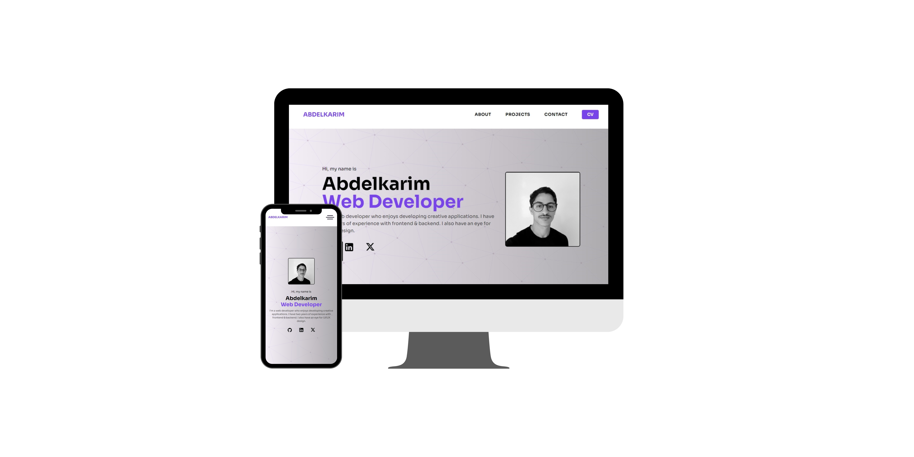

# Portfolio Website

## Description

Welcome to my personal portfolio website built using React, Tailwind CSS, and Vite. This project serves as a showcase of my work, skills, and experiences as a web developer.

## Table of Contents

- [Demo](#demo)
- [Getting started](#getting-started)
- [Installation](#installation)
- [Technologies](#technologies)

## Demo

You can explore the live demo of my portfolio website [here](https://abdelkarim-aoulallay.netlify.app).

## Getting started

Clone down this repository. You will need node.js and git installed globally on your machine.

## Installation

1. Change to the project directory:
   <mark>cd your-portfolio</mark>
2. Install dependencies:
   <mark>npm install
3. Build the project:
   <mark>npm run build
4. start the development server:
   <mark>npm run dev

## Technologies

- React.js
- TailwindCSS
- Vite
- VsCode
